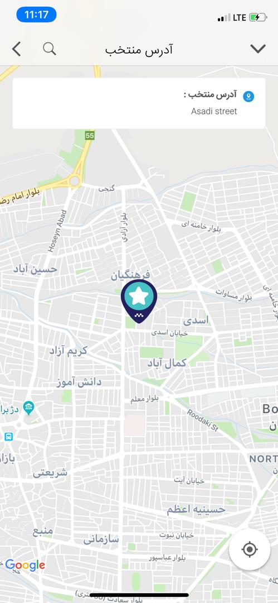
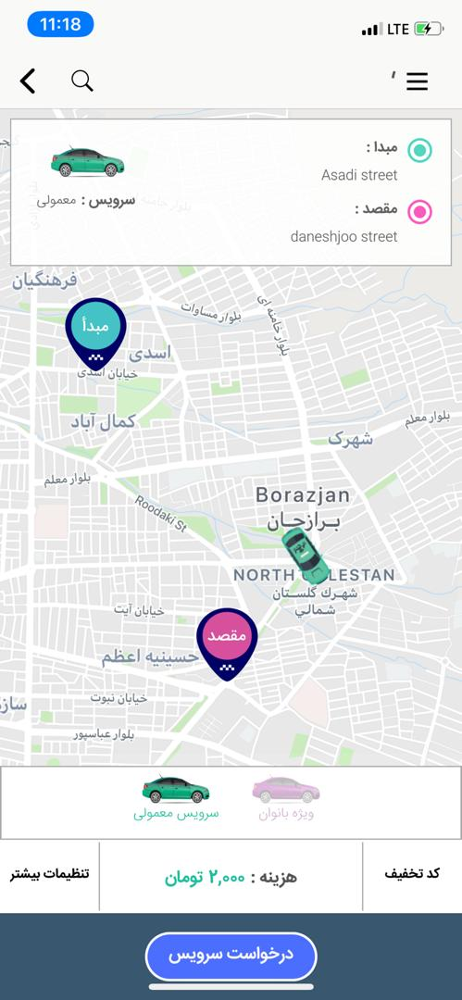
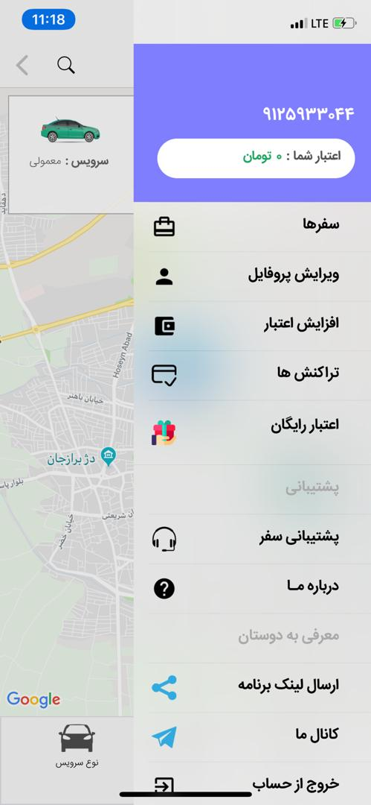
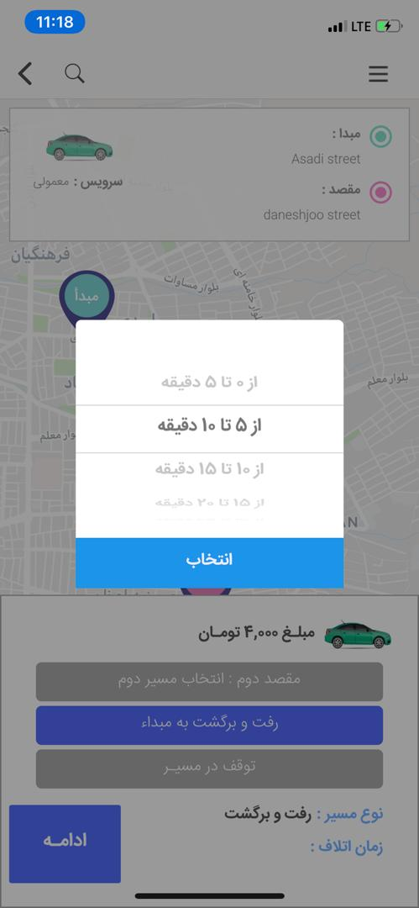
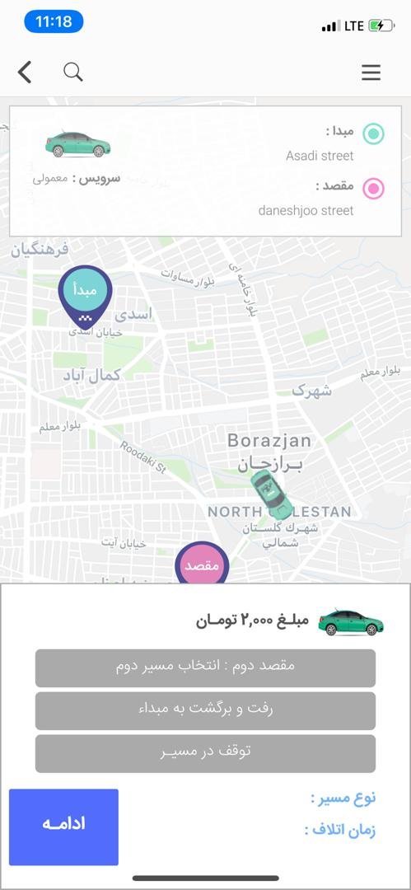
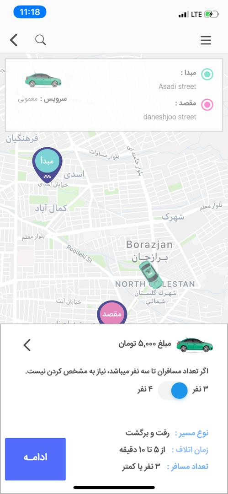
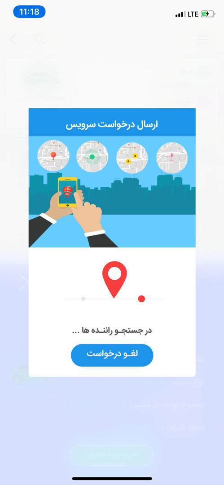
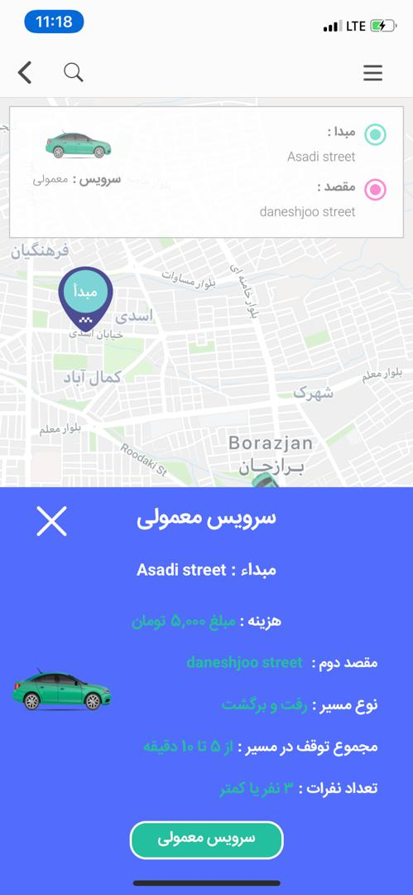

# 🚖 Bisim App

## 🌍 Overview
Bisim App is a ride-hailing mobile application, similar to Uber, that connects passengers with drivers in real time. The app allows users to request a ride by selecting their location on a map, and nearby drivers can accept the request to provide transportation. The project was initially developed for iOS and written using Swift and Xcode.

## ❓ Why Ride-Hailing Apps Like Bisim App Exist
### 🚦 Transportation Challenges in Urban Areas
In the past, city transportation was divided into two categories:
- 🚗 People who owned a private vehicle.
- 🚌 People who relied on public transport or local taxi agencies.

With increasing fuel prices ⛽, maintenance costs 🛠️, and traffic regulations 🚧, urban commuting became more challenging for both groups. Traditional taxi agencies had several drawbacks, such as high prices 💰 and limited availability ⏳. People often had to wait for extended periods, especially during peak hours or late at night.

Ride-hailing apps like Bisim App emerged as a modern solution, offering on-demand rides with better accessibility, pricing, and convenience. These applications gained massive popularity as users sought more efficient transportation options. 🚕

## 🤔 Why Use Multiple Ride-Hailing Apps?
Many users install multiple ride-hailing apps for the following reasons:
- **💸 Cost Differences:** Each service may have varying ride prices, allowing users to choose the most cost-effective option.
- **🗺️ Navigation Accuracy:** Some apps provide better routing to reduce delays.
- **😊 Driver Behavior & Service Quality:** The experience may differ based on company policies and driver professionalism.

## 🚀 Features of Bisim App
Bisim App provides essential ride-hailing features found in similar applications (such as Uber and local alternatives like Snapp and Tap30):
- **📍 Real-Time Ride Requests** – Passengers can request rides based on their location.
- **🚘 Driver Matching** – The system assigns the ride to available drivers nearby.
- **🛣️ Route Selection** – Users can choose a secondary route or return trip.
- **🎟️ Discount Codes** – The app supports promo codes for discounts.
- **📊 Trip Reports** – Passengers and drivers can view ride history and details.
- **🛤️ Multiple Destination Selection** – Passengers can set **two destinations** on the map, choosing both a primary and secondary stop during the ride.
- **⏳ Stop Duration Control** – Users can **set a waiting time** at the first destination, and the system automatically calculates the additional cost based on the stop duration.

## 🛠️ Technologies Used
- **🖥️ Swift & Xcode** – Developed natively for iOS.
- **🔗 Socket Programming** – Enables real-time communication between users and drivers.
- **🗺️ Google Maps API** – Provides location services, navigation, and route optimization.

## 📸 Screenshots
Here are some screenshots of the project:

## 📥 Download Links
- **🌐 Official Website:** [Bisim App](https://bisimapp.com/)
- **📱 iOS App Download:** [Anardoni](https://anardoni.com/ios/app/_YOPi-JH)
- **📱 Android App Download:** [Cafebazaar](https://cafebazaar.ir/app/ir.ecab.bisimapp.passenger)

> **⚠️ Note:** The initial version of the iOS app was developed by me. The current version available on the website belongs to another company.

